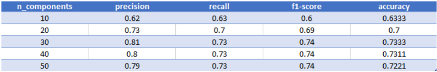
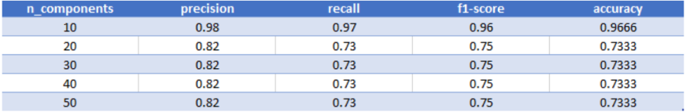
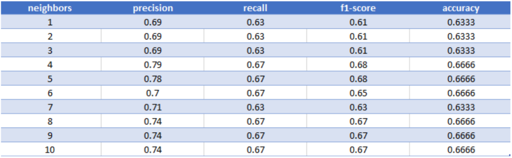
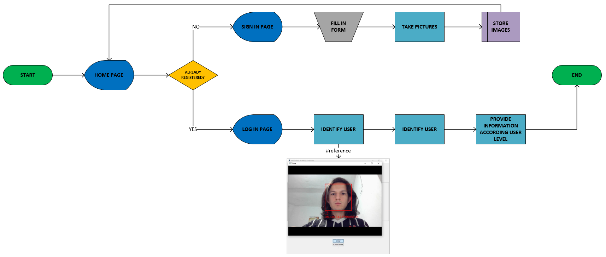

# Face Recognition
Face Recognition is a system designed to automatically detect and recognize human faces with a machine learning model, then, provide access for a private information, available according with the level of the user. 

### Models
Metrics information for each model tested:

#### Eigenfaces

#### Fisherfaces

#### LBPH (Local Binary Patterns Histograms)

**The FisherFaces model got the best metrics, then this is the one considered in the system** :robot:

### System workflow

For more details, find the full academic paper in the `doc` folder.

* It has been developed for academic work :warning:
* Academic paper in Portuguese - Brazil :warning:

### TO DO LIST
- [] Provide more details about system workflow
- [] Translate full code and message to English